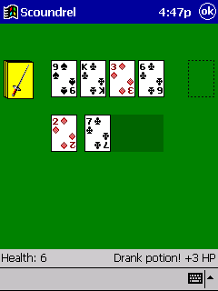
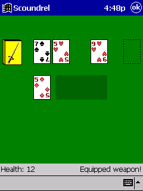
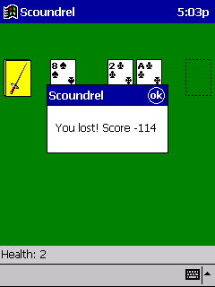

# Scoundrel

An implementation of
[Scoundrel]( http://stfj.net/art/2011/Scoundrel.pdf ) by Zach Gage and
Kurt Bieg for Windows CE 3.0 for Pocket PC.

Get the exe from the [releases page](https://github.com/keotl/scoundrel/releases).

